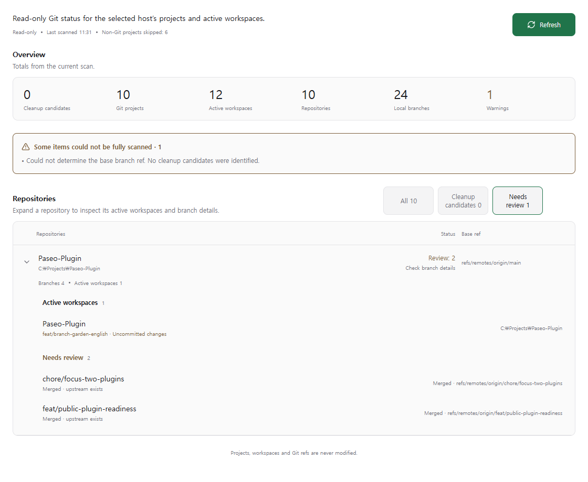
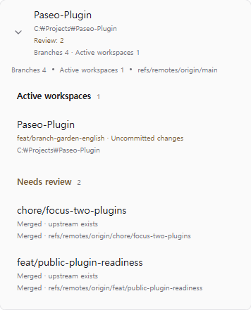

# Branch Garden

Inspect registered Git projects, active workspaces, local branches and worktrees on the selected host. No branch is checked out, reset or deleted.

[Collection](../../README.md) · [Compatibility](../../docs/COMPATIBILITY.md) · [Support](../../SUPPORT.md)

## Screenshots

Actual Paseo 0.7.2 web client, showing this public repository. The overview combines scan totals, warnings and repository filters; expanding a repository shows workspaces and the reasons branches need review.



On a compact screen, workspace details and branch evidence stack vertically:



## Install

```sh
paseo plugin add SWBaek/Paseo-Plugin:plugins/branch-garden
paseo plugin ls
```

This tracks the default branch. Use an existing reviewed tag/commit with `--ref` for a pinned installation. Review and trust source before enabling plugins; see [Git installation](../../docs/GIT_INSTALLATION.md).

## Requirements and configuration

Paseo 0.7.2 and Git on the daemon host. No repository-specific configuration is required. The plugin reads the selected host's existing Paseo project/workspace registry. Windows is the primary runtime environment; macOS/Linux automated checks and live runtime evidence are tracked separately in [Compatibility](../../docs/COMPATIBILITY.md).

## Use

Open **Branch Garden** in the sidebar, select the intended host and refresh. Expand a project to inspect workspace state, dirty worktrees and branch information. Registered projects can appear without active workspaces. Empty results mean no repositories matched the current scan or filter; they do not mean the filesystem is empty.

The plugin's labels, accessibility text, warnings and error messages are in English. Scan times use a 24-hour clock in the client's local time zone. Project, workspace and branch names remain unchanged; diagnostic details returned by Git or the host may use that tool's language. Paseo's surrounding interface follows its own language setting.

Use **All**, **Cleanup candidates** or **Needs review** to filter repositories. Expand **Kept branches** to see branches retained because they are the default branch, checked out, or unmerged with an existing upstream. Classification is advisory; this plugin never deletes branches.

## Data access and limitations

Reads project/workspace metadata and bounded read-only Git commands. It never prunes worktrees, deletes branches or writes Git configuration. Detached HEAD, missing repositories and scan failures are displayed explicitly. A snapshot can become stale while another process changes the repository.

## Troubleshooting

Check that Git is installed on the daemon host, that the selected host owns the workspace and that its repository still exists. Refresh after external Git changes.

```sh
paseo plugin logs branch-garden
paseo plugin update branch-garden
paseo plugin remove branch-garden
```

Use the actual runtime ID if installed with `--id`; add `--host <host>` for another daemon. Directory development installations use `reload` instead of `update`.

