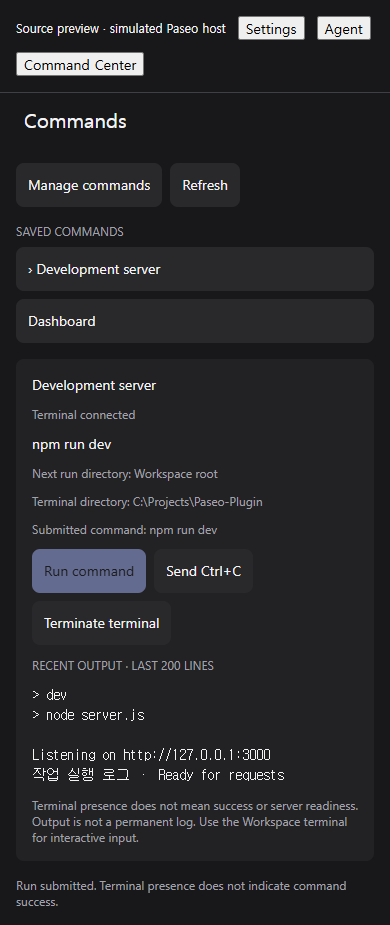
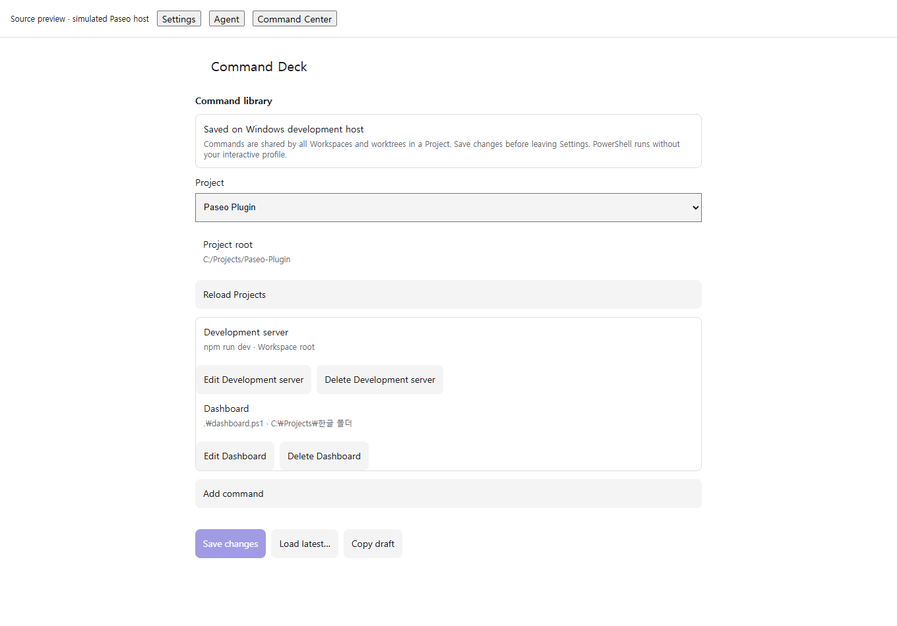

# Command Deck

Save PowerShell commands for a Project and run them from the Agent Composer or a Workspace panel. **Experimental, unreleased; Windows hosts only.** Requires Paseo daemon/app/CLI **0.8.0-beta.1**, PowerShell 7 on the daemon PATH, and the tools used by your commands (for example Node.js/npm).

Source and Windows SDK checks are complete as described in the [verification record](../../docs/verification/command-deck-0.8-source.md). Backend installation/reload passed; installed app/mobile interaction verification remains pending. Existing verification reports for the other three plugins do not cover Command Deck.

## Source previews

These images render the actual source components with a **simulated Paseo host**, not an installed app or a native phone. Host-provided settings and modal primitives are approximations.





## Install current source

Review the source on the daemon host. Check the existing runtime IDs and use a separate `--id` if needed. Enable plugins in Paseo Settings only if you choose to trust them. From this repository root in PowerShell:

```powershell
$repoRoot = (Resolve-Path .).Path
paseo plugin ls
paseo plugin install (Join-Path $repoRoot "plugins\command-deck")
paseo plugin ls
```

The default manifest ID is `command-deck`. On a remote 0.8 daemon, put `--host <target>` before `plugin`. Installation is per daemon. The `^0.8.0` manifest range includes beta.1; daemon and app requirements are checked separately.

After a reviewed commit containing this plugin is published, Git evaluation can use:

```powershell
paseo plugin add NaruForge/Paseo-Plugin:plugins/command-deck --ref <reviewed-command-deck-ref>
```

Replace the placeholder with that published commit/tag. Command Deck is absent from `v0.1.0-rc.2`. This command is not evidence that Git installation has been verified.

## Use

1. Open **Settings → Plugins → Command Deck** and select a Project.
2. **Add command**: enter its name, one PowerShell command line, and optionally its working directory. For example `npm run dev` or `.\dashboard.ps1`.
3. **Apply to draft → Save changes**. Leaving Settings discards unsaved edits. The library belongs to this host/installation and uses revision conflict protection.
4. Open the Agent Composer's **Commands** button, or **Open workspace commands** in Command Center. No Agent is required for the Command Center route.
5. Select a command and press **Run command**. Inspect its output, use **Send Ctrl+C** to request interruption, or confirm **Terminate terminal** to close it.

Commands belong to Projects and are shared across their Workspaces and Git worktrees. Run state and terminals remain separate for each Workspace. The default working directory is the Workspace root; relative paths resolve against that root, and full Windows absolute paths are accepted. `C:relative`, root-relative paths and missing directories are rejected. Environment expansion is not applied to the working-directory field.

PowerShell runs with `-NoLogo -NoProfile -Command`. Commands use the daemon's environment and privileges, not the viewing phone's shell. Profiles and execution policies are not automatically changed. Interactive prompts must be handled in the existing Workspace terminal; there is no general input field or direct terminal-tab navigation in this plugin.

## Runs and output

- Terminal presence is **not** a successful exit or a ready development server. An ended terminal has an unknown command result.
- While the panel is mounted, it reads the latest 200 output lines every two seconds without overlapping polls. Long lines/responses are truncated. Previously captured output is retained in that panel after termination, but is not stored as a permanent log.
- Fast commands can exit before any output is captured. Reconnecting/reopening the panel does not recover output from terminals that have already disappeared.
- Concurrent starts for the same task share the pending operation. An existing owned terminal is reused. Creation requests are never automatically retried.
- If a response is lost, refresh and inspect the Workspace terminals. **Allow another run…** explicitly clears an unknown-run record; it does not stop an existing process and may allow a duplicate. Exactly-once execution across disconnects/reloads is not guaranteed.
- Changing a saved command affects its next run only. Removing a command leaves its terminal accessible under **removed command** in the panel.
- Client disconnect and plugin cleanup do not kill terminals. Matching installation/task markers allow rediscovery after reconnect or runner recreation. Do not rename these terminals if you want automatic discovery. Ambiguous ownership is never automatically terminated.
- The daemon owns terminal lifecycle. There is no automatic relaunch after daemon restart. Terminating a terminal may interrupt unsaved work; processes deliberately detached by a command need separate management.
- Opening a development website remotely requires its own network/preview route. The host's `localhost` URL is not automatically available on your phone.

## Update and remove

Check `paseo plugin ls` on the intended daemon before lifecycle commands. Use `paseo plugin reload <runtime-id>` for reviewed directory-source edits; do not restart the daemon. Git installs use `paseo plugin update <runtime-id>`. Confirm status and errors with `plugin ls` and `plugin logs <runtime-id>`.

Settings survive reload, disable, update and daemon restart. **Removing an installation deletes its commands and installation identifier.** Copy the draft before removal if needed; there is no import feature. Terminals are not automatically killed, and a reinstalled plugin will not adopt the old installation's terminals. Inspect/stop them before removing the plugin.

## Development

```powershell
npm run typecheck --workspace command-deck
npm test --workspace command-deck
npm run check
```

The source uses official Settings and Terminal SDK APIs. Server RPCs coordinate run ownership and requests; clients use the selected host's connection. Saved commands and output are ordinary user data, not a credential vault. The plugin adds no command/output backend logging, telemetry, custom process manager or direct vendor HTTP.

See [#104](https://github.com/NaruForge/Paseo-Plugin/issues/104), [implementation #105](https://github.com/NaruForge/Paseo-Plugin/issues/105), and [verification and remaining runtime checks](../../docs/verification/command-deck-0.8-source.md).

Existing version 1 settings preserve command and installation IDs during migration. Known Workspace-to-Project links are resolved in the client; Save changes persists those links with revision protection. Unresolved commands remain under **Needs Project assignment** for manual selection. No commands or terminals are deleted by migration.
